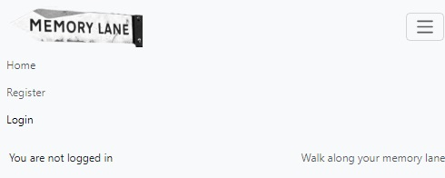
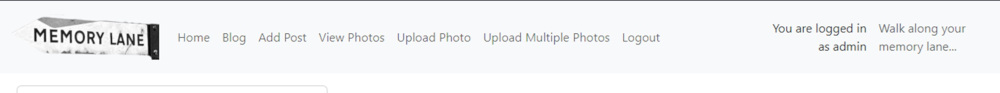
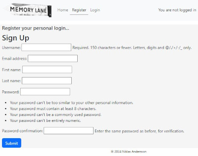
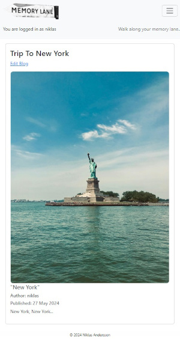

# PROJECT PORTFOLIO FOUR - MEMORY LANE - PHOTO BLOG

The deployed app [Heroku](https://photoblog-nianswe-1c8d81b27564.herokuapp.com/) 

[Github Repository](https://github.com/nianswe/photoblog) 

# Table of Contents

- [Project Goals](#project-goals)
- [UX](#ux)
    - [Agile Tools](#Agile-Tools)
- [Design and Structure](#design-and-structure)
    - [Kanban Boards](#kanban-boards)
    - [Functional Structure](#functional-structure)
- [WireFrames](#Wireframes)
- [Features](#features)
    - [Navigation Bar](#navigation-bar)
    - [Pages](#pages)
- [Responsive Design](#responsive-design)
- [Future Features](#future-features)
- [Technology Used](#technology-used)
    - [Languages](#languages)
    - [Frameworks, Libraries, and Programs](#frameworks-libraries-and-programs)
    - [Database](#database)
    - [Program and Tools](#program-and-tools)
- [Testing](#testing)
    - [Bugs](#bugs)
        - [Manual Testing](#manual-testing)
        - [Browser Testing](#browser-testing)
    - [Validation](#validation)
        - [HTML Validation](#html-validation)
        - [CSS Validation](#css-validation)
        - [Python Validation](#python-validation)
        - [Lighthouse](#lighthouse)
- [Deployment](#deployment)
    - [Github](#github)
    - [Heroku](#heroku)
- [Credits](#credits)
    - [Code](#code)
    - [Content](#content)
    - [Media](#media)
    - [Inspiration](#inspiration)

# PROJECT GOALS
This is a project under the Code Institute Full Stack Developer Diploma Program.
This website is photo blog called Memory Lane, where you can in a private view save and publish your memorys and photos, also publish the photos on the public site.

# Fundamentals

User stories

* Create Repository in Github
* Create external Database at PostgreSQL from Code Institute
* Create Django Project Memory lane and apps Authentication, Home, Blog
* Prepare for deploy to Heroku
* Publish website on Heroku.
* Setup User Authentication in Django, with Register user, Login, Logout

# UX

User stories
* Setup Image Upload
* Home page with view of all Published photos
* Create Blog post with upload image as authenticated user
* View Blogposts in list as authenticated user
* View specific Blogpost as authenticated user
* Edit specific Blogpost from View specific Blogpost as authenticated user
* Register User Account
* Log in as a User.
* Setup external storage for images/photos in Cloudinary

## Agile Tools

The Projects section in GitHub was used for this project. A Kanban board was used for the development of this project, which made it possible to break down the project into subtasks and make it easier to complete and track project progress.
  

# Design and Structure

The layout and design of this site was kept basic and simple. Minimal color was used to keep it simple.

## Kanban Boards

[Kanban Board](https://github.com/users/nianswe/projects/4) was used to create this project.
User Stories were moved through the process from To do >> In Progress >> Done on the Kanban Board.

Here you can see my overview of my kanban board and moving items around as I was working on them.

## Functional Structure
Home page: The home page contains a navigation menu, logo and a photo collection of all photos uploaded with the status PUBLISH and publish status/pubstatus SHARED.

Registration page: The user must create an account be able to access and edit content as blogposts, images/photos and upload and change images/photos. To do this, they are asked to fill out a form on the page with the required fields: username, email address (optional), first name, last nameand password. 

Login page: A username and password are required to log in for existing users. Once signed in, they are directed to the blog page.

Logout page: Logging out of the account is done through the menu, after which the user is redirected to the logout page where they must confirm their desire to log out of the account. After a successful logout, the user is returned to the home page.

Blog page: The page is only available to authenticated users and displays all blogposts. A user cannot access this page unless they are registered and logged in. If the logged in user is the author of a blogpost an Edit Blog link is shown on the top above the image, in the Edit Blog form you can as an author edit and delete the blog post.

View Photos: The page is only available to authenticated users and displays all images/photos with information, description, publisher and publish date. A user cannot access this page unless they are registered and logged in.

Upload Photo: The page is only available to authenticated users. You can upload a single image/photo by clicking the Choose file file picker button, you should describe the image in Caption field, set the stus to Published or Draft, and set the Pubstatus/Publish status to shared if the image shuld be available on the photo colection on the hom page, of pubstatus is set to Private the image is only available for authenticated/logged in users.

Upload Multiple Photos: The page is only available to authenticated users. This page is simular at the Upload Photo but you can upload multiple photos at the same time by clicking the Choose file file picker button, you should describe the image in Caption field, set the stus to Published or Draft, and set the Pubstatus/Publish status to shared if the image shuld be available on the photo colection on the hom page, of pubstatus is set to Private the image is only available for authenticated/logged in users.

# Wireframes

Wireframes where used to create the basic layout of the project. The wireframes pages can be seen below:

### Homepage:

### Blog Page:

!

### Photos Page:

# FEATURES

## Navigation Bar

The navigation bar is present on all pages of the site. As a non authenticated user Home, Register and Login.
As a authenticated user Home, Blog, View Photos, Upload Photo, Upload Multiple Photos, Logout.
The navigation bar is an adaptive element, and on mobile screens it collapses into a hamburger icon.

### Navigation for an unauthorized user:

### Navigation for an authorized user - registration disappears:

## Pages

### Registration Page - Where a user can sign up to create a user:

### Login Page - Where a registred user can log-in:

### Home Page - Where a guest or logged in user can see collection of photos with status PUBLISH and pubstatus(publish status) SHARED:

### Blog Page - Where an logged in user can view the blog posts and attached images/photos:

### Photo Page - Where an logged in user can view all images and information about them, like bubilsher and publish date:

### Upload Image - Where an logged in user can upload a singel image/photo:

### Upload Multiple Image - Where an logged in user can upload multiple images/photos:

### Add Post - Where an logged in user can create a blog posts.

### View Blog Post - Where an logged in user can view a blog posts and if auther af the post click Edit Blog to edit:

### Edit and Delete Blog Post - Where an logged in user can edit or delete a blog posts.
Change title, change body, change photo to another already uploaded photo, change status to Draft if Published and Published if Draft.
Delete Blog Post:

### Delete confirmation - Confirmation when a user delete a blog posts.
Confirmation view when a user choose to delete a blogpost, with possibillity to abort.

### Footer 
Footer only include information about Copyright without links.

### Main Admin Page - Main Admin page to overview blogs and photos:

### Admin Blog - Where Admin can view blog posts and choose to edit or delete:

### Admin Photos - Where Admin can view all uplodad images.

### Admin Blog Add- Where Admin can add a blogposts:

### Admin Photos Add - Where Admin can upload and comment new images.

### Admin Blog Edit- Where Admin can view blogposts edit information, status or delete a blog post:

### Admin Photos Edit - Where Admin can edit information or delete images.

# Responsive Design

The site has been designed to be responsive and adapted for use on both desktop and mobile devices. The project has been tested using a multi-device emulator with different screen sizes in the Google Chrome Developer Dashboard.

# Future Features

* Public blog page for guests and non authenticated visitors, content published based on status SHARED on blog posts, witch is not activ now.
* Comment function on blog posts and on specific images/photos, where logged in users can comment and give feedback.
* Create a user profile where the logged in user can view and edit own posts.
* Add Crispy-forms to make it possible to write more stilish blog posts.
* Event function where users can group blogposts and images together and publish in own views of the event and add description about the event.
* Add geotag function with GPS coordinate information and pin location of location on a map on the photo view page.
* Change password and Reset password via email function.
* Improve Photo view  

# Technology Used:

## Languages:

* Python
* JavaScript
* HTML5
* CSS3

## Frameworks, Libraries, and Programs:

* [Django](https://pypi.org/project/Django/4.2.13/): Python framework used to create all the backend
* [Bootstrap](https://getbootstrap.com/): Frontend framework used to provide structure, style, and responsive behaviour

## Database:
* [PostgreSQL](https://dbs.ci-dbs.net/): PostgreSQL from Code Institute, database used to store all the data 

## Programs and Tools:

* [Google Fonts](https://fonts.google.com/): Was used to to incorporate font styles
* [Font Awesome](https://fontawesome.com/): Was used to create the icons used on the website
* [Gitpod](https://gitpod.io/workspaces): Gitpod was used as IDE to commit and push the project to GitHub.
* [GitHub](https://github.com/): Was used to store my code
* [Pip3](https://pypi.org/project/pip/): To install Python modules and libraries
* [Gunicorn](https://docs.djangoproject.com/en/4.1/howto/deployment/wsgi/gunicorn/): "Green Unicorn" is a Python Web Server Gateway to translate HTTP Requests for Python to understand
* [Spycopg2](https://pypi.org/project/psycopg2/): PostgreSQL database adapter so I can manage the Database in Python
* [Cloudinary](https://cloudinary.com/): The image hosting service used to upload images and other media.
* [Heroku](https://dashboard.heroku.com/apps): The hosting service used to host the website
* [VSCode](https://code.visualstudio.com/): The IDE used to develop the website
* [Chrome Developer Tools](https://developer.chrome.com/docs/devtools/open/): Was used to debug the website
* [W3C Validator](https://validator.w3.org/): Was used to validate HTML5 code for the website
* [W3C CSS validator](https://jigsaw.w3.org/css-validator/): Was used to validate CSS code for the website
* [Pep8 Validator](https://pep8ci.herokuapp.com/): Was used to validate python code for the website
* [Github Projects](https://github.com/): Kanban board was used to track the progress of the project in general and of every application in the project
* [Wireframes](https://balsamiq.com/learn/articles/what-are-wireframes/): Was used to created the outline for my project

# Testing

## Bugs

###
No known bugs remaining

### Manual Testing

Testing was done throughout the process while developing the project by the use of Django debug pages and printing statements to check that the code functioned accordingly. In addition, thorough testing has been performed and is described below, it contains manual test to check that all user stories and acceptance criteria are met, as well as testing and validating the code with different online tools as presented below.

### Browser Testing

Testing has been carried out on the following browsers:

* Google Chrome
* Firefox
* Safari

The site was constantly tested during the process of creating the site in the Gitpod Environment and the deployed site on Heroku was also tested in terms of user experience. The available functionality and user experience is reflected in the table below.

| Goals and Actions | As a Guest | As a User | Comment |
| -------- | -------- |  -------- | -------- |
| # Non Authenticated users # |  |  |  |
| I can see the Home, Register and Login on menu when a user is not authenticated   | X |  |  |
| I can see the Register/Sign up Page. | X |  | You can complete user a registration after ckicking the Register menue item an an non authenticated user |
| I can see the Login Page | X |  | You can complete a user login with a valid registred user account.
| I can see the Home Page and all published images  | X | X |  |
| # Authenticated users # |  |  |  |
| I can see the Home, Add Post, View Photos, Upload Photo, Upload Multiple Photos and Logout on menu when a user is authenticated   |  | X |  |
| I can see the Home Page and all published images  | X | X |  |
| I can see the Blog Page  |   | X |   |You can click on a blog post, see information and the Edit post button if I you ar the author of the post |
| I can upload single image  |  | X | You can view the image on the Photo View and if pubstatus:SHARED on the Home page  |
| I can upload multiple images  |  | X | You can view images on the Photo View and if pubstatus:SHARED on the Home page |
| I can edit a particular blog post.  |   | X | You can see the edited blog post in the Blog Page |  |
| I can delete a particular blog post |   | X | You will get a confirm deletion message at confirm delete page with possibillity to abort |

| Bug| Solution | 
| ------- | ------- |  
| 

## Validation

### HTML Validation:
The W3C Markup Validation Service was used to validate the HTML of the website. There were errors and warnings in the reports about unclosed elements and tags, incorrect values ​​and types of elements, and unnecessary trailing slashes. All errors and warnings have been fixed, the project's HTML code has been re-checked without significant errors.

### CSS Validation:
The website CSS style has successfully passed the W3C Jigsaw CSS Validation Service.

### Python Validation (PEP8)
All Python code was manually checked using CI Python Linter. The Linter reports had messages about exceeding the string length of 79 characters, which have been fixed. Re-testing did not reveal any errors.

During testing a few issues were identified and corrected:

* Extra whitespace was deleted
* Indentations were corrected
* Two lines spaces between functions and classes
* All lines adjusted to <80 characters
* Minor errors with missing closing tags

### Lighthouse

# Deployment
I followed the below steps using the Code Institute tutorial. The project was first created in GitHub, then using the workspace in CodeAnywhere, and then in Gitpod again for most of the project. The project code is stored on GitHub, and then deployed to Heroku. To deploy, follow these steps:

## Github

1. Create an account at GitHub or login to an existing account.
2. Go to the GitHub repository for Photoblog.
3. Click the 'Code' button and copy and paste code Gitpod workspace.
4. A copy of the repository will be available in your own workspace.

## Heroku
The site is deployed to Heroku through the following steps:

1. Log in to Heroku or create an account, if required. On the Welcome page in the top right corner click the button labeled 'New'.
2. From the drop-down menu select 'Create new app'. Enter a preferred app name. Select the relevant geographical region. Click to 'Create App'.
3. Navigate to 'Settings' and scroll down to the 'Config Vars' section. Click 'Reveal Config Vars', click 'Add'. Add CLOUDINARY_URL, DATABASE_URL and SECRET_KEY. URL variable values ​​must be copied from your [CLOUDINARY](https://cloudinary.com/) account and [PostgreSQL from Code Institute](https://https://dbs.ci-dbs.net/) account. To create a SECRET KEY, use the online service or come up with your own.
4. Click on the 'Deploy' tab. Next to 'Deployment method' select 'GitHub'. Connect the relevant GitHub repository. Under 'Manual deploy' choose the correct branch and click 'Deploy Branch'. Also you can select 'Automatic Deploys' so that the site updates when updates are pushed to GitHub.
5. After successful deployment message in the page top right corner click the button labeled 'Open app' and you can access live app.

# Credits

## Code
The structure and the code of the project was based on two walkthroughs by the Code Institute:

* Hello Django - I created CRUD functionalities based on the examples of this walkthrough.
[Django Documenation](https://www.djangoproject.com/) was used to provide examples of code solutions and Django functionality.
* [Bootstrap Documenation](https://getbootstrap.com/)  was used to provide examples of Bootstrap functionality and building blocks.
* [Code Institute WalkThroughs](https://codeinstitute.net/se/) "Hello Django" and "I Think Therefore I Blog" worked as inspiration and code examples.
* [openclassrooms.com - Intermediate Django](https://openclassrooms.com/en/courses/7107341-intermediate-django/7263818-create-a-sign-up-page)

## Content

## Media

All images is free to use from [Pexels](https://www.pexels.com/).

## Inspiration

* This project was inspired by the "Hello Django" and the "I Think Therefore I Blog" projects from Code Institute.
* Also functionality like login function and upload image function from openclassrooms.com - Intermediate Django Course.
* Jaimilit's Readme.md file was used as a template for writing my own Readme.md. (https://github.com/Jaimilit/CrossFit-Signup/blob/main/README.md)

